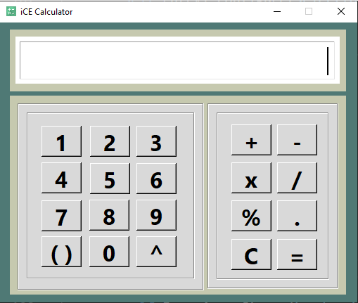

# iCECalculator_simple
A simple calculator designed overnight with tkinter. Help of PAGE.

The only changes to make is to provide the full path to the icon on line 66 in the *unknown.py* file.

Final output should be like ....

